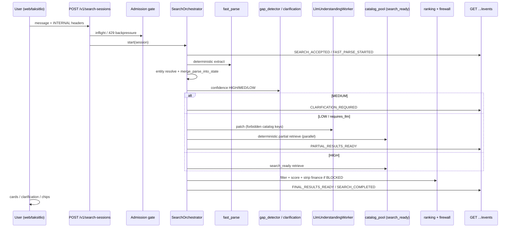

# CURRENT SYSTEM DEEP AUDIT — Taksitlio Doğal Dil Ürün ve Kampanya Sistemi

**Generated:** 2026-08-02 (read-only)  
**Mode:** CODE + CONFIG + PRODUCTION DB READ-ONLY + EXISTING ARTIFACTS  
**Decision class:** **PARTIALLY_USABLE** (INTERNAL product search) · **NOT public** · **Campaign/finance blocked**  
**Artifacts:** `artifacts/current-system-deep-audit/`  
**Rules honored:** no code/migration/flag/deploy/backfill/traffic/golden writes; live `POST /v1/search-sessions` smoke = `NOT_EXECUTED_WRITE_RISK`

> Past verification reports are treated as **claims**. This audit re-checks code + live DB + artifacts. Where report ≠ DB, the discrepancy is explicit.

---

## 0. Executive verdict

| Dimension | Verdict |
|---|---|
| Basic natural-language **product** search (INTERNAL) | **INTERNAL_ACTIVE** — works on cohort (Vatan + Hepsiburada, 1054 search-ready) |
| Complex / multi-item / conditional planner | **NOT_IMPLEMENTED** |
| Multi-turn constraint editing | **PARTIAL** (UPDATE/DELETE/REQUIRE/PREFER; no RELAX/ROLLBACK) |
| Campaign / taksit fulfillment on active cohort | **BLOCKED_BY_DATA** (`finance_ready_product_count=0`) |
| Finance UI / ranking | Code exists; **BLOCKED** behind firewall (correct) |
| Public canary package | **PUBLIC_CANARY_PACKAGE_READY** |
| Live public / 5% traffic | **NOT_STARTED** (human evidence gates FAIL) |
| Overall product goal vs “daily Turkish sentence → products + verified campaigns” | **PARTIALLY_USABLE** for products; **NOT_USABLE** for campaigns |

---

## 1. Product goal coverage (what actually works today)

Target: user writes natural Turkish → system understands need/category/budget/preferences/negations/merchant/campaign → shows real catalog products + verified campaigns.

| Goal slice | Status | Evidence |
|---|---|---|
| Understand category / merchant / brand / budget / negation | **TESTED_REAL_DATA** | `fast_parser.py`, P3.7 golden/browser |
| Find real catalog products with image+category | **INTERNAL_ACTIVE** | `search_ready_product_projection` n=1054; browser integrity 120 cards / 0 wrong |
| Complex hard/soft/conditional/multi-item plans | **NOT_IMPLEMENTED** | no planner schema in `src/` |
| Multi-turn ADD/REMOVE style edits | **PARTIAL** | `query_state` + constraint API |
| Verified campaign / installment offers | **BLOCKED_BY_DATA** | cohort finance_ready=0; agreements on other merchants only |
| Public users | **NOT_STARTED** | `traffic_state=NOT_STARTED` |

---

## 2. Repository & runtime inventory

See `artifacts/current-system-deep-audit/repository-inventory.json`, `runtime-services.json`.

| Layer | Value |
|---|---|
| Backend | FastAPI + Uvicorn · `src/taksitlio/` · `uv` |
| Frontend | Vanilla static SPA · `web/taksitlio/` |
| DB | PostgreSQL 16 + pgvector · `127.0.0.1:5432` |
| Cache | Redis 7 · `127.0.0.1:6379` |
| API | `taksitlio-api` systemd · uvicorn **pid 3839514** · `127.0.0.1:8040` · `/health` → `{"status":"ok"}` |
| Crawl/queue | StormCrawler + ZK (separate compose); partner ops scripts on server |
| LLM | OpenAI-compatible remote + deterministic fast parser; LoRA FAST candidate exists (Campaign Gate CLOSED) |
| Deploy | systemd + nginx portal · workdir `/data/nanobaseai/taksitlio-chatbot` |

Two orchestrators coexist:

1. **Primary (ADR-011):** `POST /v1/search-sessions` → `SearchOrchestrator` → SSE  
2. **Legacy (ADR-007):** `POST /v1/chat` → `ChatOrchestrator` (need profile / semantic category)

---

## 3. Migration & schema status

See `migration-status.json`.

| Migration | File | In `schema_migration_history`? | Effectively applied? | Notes |
|---|---|---|---|---|
| V028 | yes | **yes** | yes | recovery P1 |
| V029 | yes | **yes** | yes | adaptive catalog |
| V030 | yes | **yes** | yes | flags + `search_ready_product_projection` |
| V032 | yes | **yes** | yes | cohorts / readiness |
| V033 | yes | **yes** | yes | last row in history (total **33**) |
| V034 | yes | **NO** | **yes (tables+data)** | harness `conn.execute(sql)` without history insert |
| V035 | yes | **NO** | yes | golden review history (44 rows) |
| V036 | yes | **NO** | yes | shadow/UAT/canary tables |
| V037 | yes | **NO** | yes | package/traffic + diversity policies |
| V038 | yes | **NO** | yes | human evidence closeout objects |

**Discrepancy (report vs DB):** harness artifacts claim `migration-v034…v038.json` `status=APPLIED`, but production `schema_migration_history` max recorded is **V033**. Objects exist because scripts applied SQL directly (`scripts/run_p3_7_*.py`, `run_p4_*.py`).

### Table reality (production counts)

| Table | Exists | Count |
|---|---|---:|
| `catalog_domain_events` | yes | 205031 |
| `runtime_feature_flags` | yes | 6 |
| `merchant_readiness_snapshots` | yes | 2685 |
| `merchant_category_readiness_snapshots` | yes | 3498 |
| `product_readiness_projection` | yes | 1810 |
| `search_ready_product_projection` | yes | **1054** |
| `search_ready_product_projection_v2` | yes | 1054 |
| `search_release_cohorts` | yes | 2 |
| `search_release_cohort_versions` | yes | 17 |
| `search_release_cohort_members` | yes | 2358 |
| `source_capability_profiles` | yes | 15 |
| `category_quality_dimension_policies` | yes | 1 |
| `continuous_golden_cases` | yes | 425 |
| `continuous_golden_review_history` | yes | 44 |
| `products` / `product_offers` | yes | 213092 |
| `merchants` | yes | 26 |
| public shadow/canary/UAT family | yes | see §28 |

---

## 4. Feature flags (production DB)

Source: `runtime_feature_flags` (live read). Code: `src/taksitlio/runtime_flags/__init__.py`.

| Flag | Value | Scope / config | Behavior |
|---|---|---|---|
| `adaptive_catalog_enabled` | **ENABLED** | `{}` | catalog consumers on |
| `learning_candidate_generation_enabled` | **ENABLED** | `{}` | learning candidates allowed |
| `learning_auto_promotion_enabled` | **DISABLED** | `require_gate=true` | auto-promote blocked (intentional) |
| `dynamic_readiness_enabled` | **INTERNAL** | `traffic=internal_only`, `cohort_id=1`, **`cohort_version=1`** | INTERNAL readiness path |
| `adaptive_ranking_enabled` | **SHADOW** | `topk=50` | not fully ENABLED |
| `rolling_golden_enabled` | **ENABLED** | `{}` | rolling golden collection |

**Drift:** flag config still pins `cohort_version=1` while cohort **v2** row is `PUBLIC_CANARY` / `PUBLIC_CANARY_PACKAGE_READY` / `traffic_state=NOT_STARTED`.

---

## 5. End-to-end user flow

See `end-to-end-flow.json`.



**Fallback:** LLM failure → deterministic empty preferences (no invented products). INTERNAL empty search-ready → **no unrestricted catalog fallback** (P3.6/P3.7 regression PASS).

---

## 6. NLU capability detail

See `query-capability-matrix.json`. Implementation: `src/taksitlio/query_understanding/fast_parser.py` (`FastParseResult`, `fast_parse`).

| Capability | Status | Notes |
|---|---|---|
| Category | TESTED_REAL_DATA | alias index + family tokens |
| Merchant | TESTED_REAL_DATA | catalog aliases |
| Brand | TESTED_REAL_DATA | |
| Budget max | TESTED_REAL_DATA | “X bin TL” etc. |
| Budget min | NOT_VERIFIED | primarily TOTAL_MAXIMUM |
| Attributes | PARTIAL | **RAM** regex; general attrs weak |
| Negation | TESTED_REAL_DATA | 6 Turkish markers |
| Correction | TESTED_SYNTHETIC | stronger on ADR-007 path |
| Clarification | TESTED_REAL_DATA | max 2 / session |
| Typo/alias | TESTED_REAL_DATA | data-driven aliases |
| Multi-turn hydrate | TESTED_SYNTHETIC | `hydrate_parse_from_state` |
| Out-of-scope | TESTED_SYNTHETIC | |
| LLM-required | TESTED_REAL_DATA | gap LOW band |

**LLM cannot invent:** `product_id`, `merchant_id`, `price`, `rate`, `campaign_id`, payments — blocked by `validate_llm_patch()`.

---

## 7. Complex Query Planner

See `complex-query-audit.json`.

**Finding:** Expected plan contract (`request_type`, `hard_constraints`, `soft_preferences`, `conditional_exceptions`, `items[]`, `global_budget`, …) is **absent** from production code (ripgrep: no hits).

| Level | Result |
|---|---|
| Schema exists | **No** |
| Parser produces it | **No** |
| Retrieval consumes it | **No** |
| Ranking consumes it | **No** |
| E2E tested | **No** |

Partial substitutes only: `required` on entities, single `ranking_mode` enum, budget soft penalty, clarification/gap analysis.

---

## 8. Conversation state

See `conversation-state-audit.json`.

| Op | Supported? |
|---|---|
| ADD | Implicit via merge |
| REMOVE | Yes (`cancel_constraint` / DELETE) |
| REPLACE | Partial |
| RELAX | **No** |
| TEMPORARY_EXCEPTION | **No** |
| ROLLBACK | **No** |
| CLEAR | Partial (`RESET_NEED` chat path) |

API actions validated: `UPDATE|DELETE|REQUIRE|PREFER` (`search_sessions.py`).

---

## 9. Deterministic vs LLM split

| Job | Owner |
|---|---|
| Intent / category / merchant / price / attribute / negation | **Deterministic** (+ LLM preferences only when routed) |
| Clarification question selection | **Deterministic** policy |
| Ranking | **Deterministic** |
| Campaign facts / payments | **Deterministic source-backed** (and currently firewalled off) |
| Claim generation | Grounded / stripped — LLM forbidden keys |

---

## 10. Models / inference

| Role | Alias / path | Status |
|---|---|---|
| FAST understanding | runtime alias `poc-fast-understanding` / LoRA candidate `needprofile-fast-nine-b-lora-v4` on Qwen3.5-9B | training artifacts exist; Campaign Gate **CLOSED** — not quality-claimed |
| DEEP / LLM route | `LlmUnderstandingWorker` + remote OpenAI-compatible | wired; specific prod model id **NOT_VERIFIED** beyond env alias |
| Embedding | env-configured strict embedder | wired |
| Reranker | none dedicated | N/A |
| Fallback | `DeterministicFallbackProvider` | wired |

---

## 11. Query extraction schema (actual)

Contract is dataclass `FastParseResult.to_dict()` — **no separate JSON Schema file** for ADR-011 parse.

Core fields used by retrieval/ranking: merchant, positive/negative categories, brands, budget, attributes (RAM), requested_terms, ranking_mode, route/requires_llm.

Often under-used for retrieval: free-text `preferences`, multi usage contexts as hard filters, institutions (finance blocked).

Malformed LLM JSON → job failure → deterministic fallback; empty extraction → clarification or no-result paths.

---

## 12. Product retrieval

See `product-retrieval-audit.json`.

- INTERNAL uses `search_ready_product_projection` (`prefer_search_ready=True`).
- Cohort merchants live: **Vatan Bilgisayar (999)** + **Hepsiburada (55)**.
- Unrestricted fallback on INTERNAL: **disabled** — unit + P3.7 artifact PASS.
- Filters: category family tokens, merchant, brand, negation, budget; media/price required for projection membership.

Category aliases: `data/category_family_tokens/v1.json` (phone/laptop/tablet/tv) — data-driven, wired in `progressive_results/category_match.py`.

---

## 13. Catalog coverage (production)

See `catalog-coverage.json`.

| Metric | Global | Active cohort |
|---|---:|---|
| DB products | 213092 ACTIVE | — |
| Search-ready | 1054 | 1054 |
| Merchants | 26 | **2** |
| Category scopes | 3373 cats total | 326 scopes |
| Brands in search-ready | 37 distinct | — |
| Media/price on search-ready | 1054 / 1054 | full |
| Finance-ready on cohort | — | **0** |

**Cohort state (DB confirmed):**

| Version | status | package_state | traffic_state | search_ready | finance_ready |
|---|---|---|---|---:|---:|
| v1 | INTERNAL | UNKNOWN | NOT_STARTED | 1054 | 0 |
| v2 | PUBLIC_CANARY | **PUBLIC_CANARY_PACKAGE_READY** | **NOT_STARTED** | 1054 | 0 |

Latest merchant readiness: **READY=2** (Vatan, Hepsiburada), PARTIAL=12, BLOCKED=1.

---

## 14. Ranking

See `ranking-audit.json`. Modes include cheapest price + finance modes + attribute match.  
**Active product path:** price / overall value dominant.  
**Finance modes:** NOT_APPLICABLE (no finance-ready cohort products + display BLOCKED).  
User-defined priority lists: **not implemented**. Soft preference: partial budget penalty.

Load (open-loop P4.1 authoritative): 5–100 RPS success=1.0, P95≤383ms.

---

## 15. Campaign / finance

See `finance-capability-audit.json`. **This is the largest product-goal gap.**

### Global finance data (exists)

| Object | Count |
|---|---:|
| Active agreements | 4 |
| Campaigns | 5 (4 ACTIVE) |
| Rate snapshots | 7 |
| Campaign terms | 7 |
| Financial products | 2 |
| `product_finance_options` | 31829 (29472 ELIGIBLE) |

### Agreement merchants (NOT in search-ready cohort)

| Merchant | Readiness | Finance coverage | Blockers |
|---|---|---:|---|
| MediaMarkt | PARTIAL | 1.0 | category / brand / attribute |
| Teknosa | PARTIAL | ~0.92 | category / brand / attribute |
| Trendyol | PARTIAL | ~0.999 | category / brand / attribute |
| Evofone | PARTIAL | 1.0 | category |

### Active product-search cohort

| Metric | Value |
|---|---|
| Merchants | Vatan, Hepsiburada |
| Agreements | **0** |
| finance_ready products | **0** |
| finance_coverage on readiness | **0.0** |

### Matching flow status

| Step | Status |
|---|---|
| User campaign intent parse (term / ranking_mode) | WIRED |
| Eligible finance product retrieval on cohort | **BLOCKED_BY_DATA** |
| Agreement → rate → payment calc | CODE exists; inactive for cohort |
| Rank by monthly/total | CODE (`RankingMode`) · NOT_APPLICABLE live |
| Evidence validation / firewall | **TESTED_REAL_DATA** (PASS; 0 forbidden claims) |
| Frontend campaign card | Implemented; gated off when blocked |

**Firewall:** `finance_firewall.py` strips 16 claim keys when not READY/ENABLED. Cross-merchant finance fallback observed **0** in P4 artifacts.

---

## 16. Frontend

See `frontend-audit.json`. Chat UX modules exist for partial carousel, clarification, constraint chips, SSE client. Product cards show name/merchant/price/image/URL; finance only if `financeDisplayEnabled===true` (currently off). P3.7 browser integrity: 120 cards, 0 wrong product/merchant/price/image; finance claims shown 0.

---

## 17. SSE / LLM partial

See `sse-audit.json`. Full event contract in `web/taksitlio/js/search-session/client.js`. Last-Event-ID, stale LLM `apply_if_fresh`, terminal status machine present. P3.7 SSE matrix PASS.

LLM partial n=100 (`llm-partial-browser-results.json`): first_partial API p95≈208ms; blank>4s=0; cohort leakage=0; fake partial=0.

---

## 18. Golden / Playwright / Shadow-UAT-Canary

### Golden (live DB)

| Class | Count |
|---|---:|
| APPROVED + OPERATOR_DUAL_CONTROL | **22** |
| REVIEW_REQUIRED + OPERATOR_GENERATED | 228 |
| REVIEW_REQUIRED + UNKNOWN | 175 |
| HUMAN_VERIFIED APPROVED | **0** |

Public policy (≥250 human-verified, ≥10 OOS): **FAIL**. Operator dual-control ≠ human.

### Playwright

`tests/e2e/playwright/internal_e2e.spec.ts` — **3** real-API Chromium tests (access, forged token 403, fast-path search). Finance E2E: **NOT_APPLICABLE/BLOCKED**. Harness viewports + screenshots in P3.6/P3.7 artifacts.

### Shadow / UAT / Canary

| Item | Value |
|---|---|
| Shadow observations | 1000 |
| Real unique queries | **42** (need ≥500) |
| Operator UAT | 150 |
| Genuine human UAT | **0** |
| package_state | **PUBLIC_CANARY_PACKAGE_READY** (DB confirmed) |
| traffic_state | **NOT_STARTED** (DB confirmed) |
| Live 5% | **false** |
| P4.1 / P4.2 decision | **PUBLIC_NOT_READY** |

---

## 19. Load / chaos / security

Open-loop SLO PASS (P4.1). Concurrency 250 → 23×429 (backpressure working). Chaos injected: redis/llm/ranking/catalog delay PASS; media/replica/SSE slow **not injected**.

Security: INTERNAL token fail-closed; cohort header guard; golden dual-control + row_version + audit; canary assignment sim cross-tenant leakage 0. Deep PII/secret log scan: **NOT_VERIFIED**.

---

## 20. Example query truth table (A/B/C/D)

| Query | Understanding | Plan | Catalog | UI |
|---|---|---|---|---|
| 30 bin TL’ye laptop | OK | single search | OK (cohort) | OK cards |
| Telefon değil tablet | OK (negation+family) | single | OK | OK |
| Vatan’dan TV | OK | single | OK if in scope | OK |
| En ucuz laptop | OK ranking_mode | price rank | OK | OK |
| HP istemiyorum Lenovo | OK brand± | filters | depends coverage | OK |
| 16 GB RAM şart | PARTIAL (RAM extract) | attribute filter partial | depends attrs | OK/partial |
| Bütçeyi 40→45 | PARTIAL UPDATE | — | — | chips/API |
| Önceki filtreyi kaldır | PARTIAL DELETE | — | — | API |
| Laptop+monitör+klavye 60k | **FAIL** | no multi-item/global budget | N/A | N/A |
| 12 ay taksitli laptop | term parsed | finance path | **no finance-ready** | firewall strips claims |

Live new production queries: **NOT_EXECUTED_WRITE_RISK** (session write). Evidence from P3.7/P4 harness artifacts instead.

---

## 21. Capability matrix (final)

| Capability | Status | Evidence | Blocker |
|---|---|---|---|
| Basic product search | INTERNAL_ACTIVE | P3.7 + DB cohort | — |
| Complex product search | NOT_IMPLEMENTED | no planner | planner |
| Multi-constraint parsing | TESTED_REAL_DATA | fast_parser | — |
| Hard/soft preference | PARTIAL | required + soft score | formal model |
| Conditional exceptions | NOT_IMPLEMENTED | — | planner |
| Conflict resolution | PARTIAL | negation locks | — |
| Multi-turn state | PARTIAL | UPDATE/DELETE | RELAX/ROLLBACK |
| Multi-item/bundle | NOT_IMPLEMENTED | — | planner |
| Price ranking | INTERNAL_ACTIVE | ranking.py + tests | — |
| Attribute ranking | CODE_ONLY | mode exists | attr extract |
| Product cards | INTERNAL_ACTIVE | browser integrity | — |
| Campaign intent | WIRED_NOT_TESTED | terms parsed | data |
| Campaign matching | BLOCKED_BY_DATA | finance_ready=0 | readiness |
| Monthly-payment ranking | BLOCKED_BY_DATA | modes unused live | data+gate |
| Total-payment ranking | BLOCKED_BY_DATA | | data+gate |
| Finance UI | IMPLEMENTED_NOT_WIRED | gated | data+flag |
| LLM partial | TESTED_REAL_DATA | n=100 | — |
| SSE | TESTED_REAL_DATA | matrix | — |
| INTERNAL traffic | INTERNAL_ACTIVE | flag+API | — |
| Public canary | PUBLIC_PACKAGE_READY | DB v2 | human gates |
| Public traffic | NOT_IMPLEMENTED | traffic NOT_STARTED | human evidence |

---

## 22. “Code exists but product doesn’t work” (A–D)

For **“12 ay taksitli laptop”**:

| Layer | Status |
|---|---|
| Understanding | PARTIAL — term/ranking intent extractable |
| Plan | NO formal finance plan object |
| Catalog fulfillment | FAIL on active cohort (no finance-ready) |
| Finance fulfillment | FAIL / BLOCKED (correct firewall) |
| UI | Shows products without finance claims (safe) |

For **basic “30 bin TL laptop”**: A–D largely PASS on INTERNAL cohort.

---

## 23. Priority gaps

See `priority-gaps.json`.

### P0
None newly confirmed as live wrong-product/finance claim leaks in latest artifacts (firewall PASS). Residual P0 risk if finance gate ever enabled without cohort finance-ready alignment.

### P1
1. No Complex Query Planner (multi-item, conditional, hard/soft contract)  
2. Search-ready limited to 2 merchants  
3. Finance data on PARTIAL merchants only; cohort finance_ready=0  
4. Public human evidence missing (shadow 42, golden human 0, UAT human 0)  
5. Campaign product promise unmet despite code  

### P2
Migration history drift V034–V038; flag cohort_version drift; weak attributes; missing RELAX/ROLLBACK; Playwright thin.

### P3
Ops/UX/load polish; deeper security log audit.

---

## 24. Production backlog (do not implement in this task)

See `production-backlog.json` (`BL-NLU-01` … `BL-PUB-01`). Highest leverage: **planner**, **catalog/finance readiness for non-cohort merchants**, **human public evidence**.

---

## 25. Direct answers

1. **Can a user find products with normal Turkish today?** Yes, via **INTERNAL** product search on Vatan/Hepsiburada cohort — not as full public product.
2. **Reliable queries:** budget+category, merchant filter, brand include/exclude, negation category family, cheapest ranking, clarification, SSE partials.
3. **What breaks on complex/long queries:** multi-item/global budget, conditional exceptions, preference priority lists, rich attributes, RELAX/ROLLBACK dialogs.
4. **Hard vs soft?** Only partial (`required` + soft score) — not a first-class model.
5. **Conflicts/conditionals?** Negation locks yes; conditional “unless very advantageous” **no**.
6. **Multi-product basket?** **No**.
7. **Campaign/taksit real offers?** **No** on active cohort (firewall correctly hides claims).
8. **Where is campaign data?** MediaMarkt, Teknosa, Trendyol, Evofone agreements (+ options globally).
9. **What blocks those merchants from search-ready?** PARTIAL readiness — category/brand/attribute coverage thresholds (not finance absence).
10. **INTERNAL openable?** **Yes** — P3.7 INTERNAL READY; treat as limited-merchant product search.
11. **Why no public canary traffic?** Human gates: unique shadow 42≪500, 0 HUMAN_VERIFIED golden, 0 external UAT; auto-start forbidden. Package ready ≠ traffic started.
12. **What’s missing for production-complete goal?** Planner + broader READY/search-ready catalog + finance-ready on search cohort + human public evidence + finance gate enablement only after data honesty.
13. **How much code is reusable?** Search session pipeline, SSE, firewall, search-ready, ranking skeleton, clarification — **keep**. Need **new** planner/state ops and **data** readiness work — not a full rewrite.
14. **Single final sprint?** **MULTI_PHASE_REQUIRED** (NLU planner, catalog/finance data, human public evidence are independent critical paths).

---

## 26. Assessment

```text
FINAL ASSESSMENT: PARTIALLY_USABLE
PRODUCTION COMPLETION SHAPE: MULTI_PHASE_REQUIRED
```

**No code was changed by this audit.** Helper read-only scripts under `artifacts/current-system-deep-audit/_ro_db_audit*.py` and raw dumps `_db_raw*.json` are audit evidence only.
